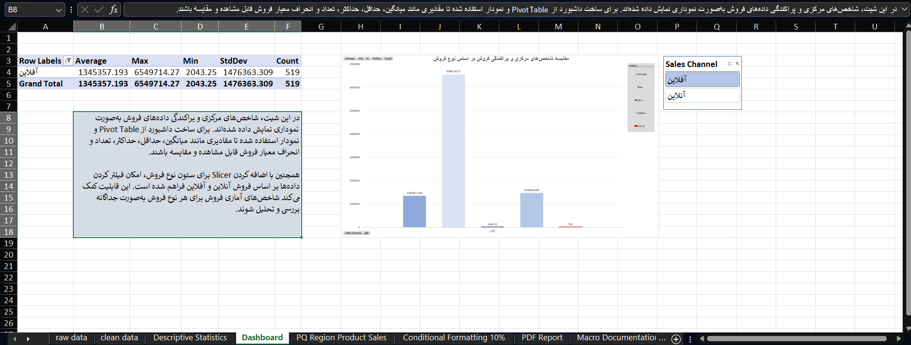

# Sales Performance Analysis with Excel

## Project Overview

This project is an Excel-based sales data analysis and reporting project.
It focuses on analyzing sales performance using Microsoft Excel tools such as descriptive statistics, Pivot Tables, slicers, Power Query, Conditional Formatting, dashboarding, and VBA macro automation.

The goal of this project is to transform raw sales data into meaningful business insights and automate regional PDF report generation.

---

## Objectives

The main objectives of this project were:

* Provide comprehensive descriptive statistics for the dataset
* Analyze central tendency and dispersion indicators
* Create visual analysis using charts and slicers
* Analyze total sales by region and product type using Power Query
* Highlight the top 10% of sales records using Conditional Formatting
* Build an interactive Excel dashboard
* Create a VBA macro to generate PDF reports by region
* Display sales amount and count based on product type and sales type in the PDF reports

---

## What Was Done

### 1. Raw Data Review

The original dataset was reviewed to understand its structure, columns, and business meaning.

This step helped identify the key fields needed for analysis, including sales-related columns, region, product type, and sales type.

---

### 2. Data Cleaning

A cleaned version of the dataset was created to make the analysis more organized and reliable.

The cleaned data was used as the main source for Pivot Tables, charts, Power Query analysis, and reporting.

---

### 3. Descriptive Statistics

Comprehensive descriptive statistics were calculated for the main numerical fields.

This included statistical indicators such as:

* Mean
* Median
* Minimum
* Maximum
* Standard deviation
* Variance
* Range
* Count

These statistics helped summarize the dataset and understand the distribution of sales-related values.

---

### 4. Central Tendency and Dispersion Visualization

Central tendency and dispersion indicators were visualized using charts.

A slicer was also added to filter the analysis based on sales type, making the analysis more interactive and easier to explore.

---

### 5. Pivot Table Analysis

Pivot Tables were used to summarize and analyze the dataset from different business perspectives.

The analysis included:

* Sales performance by region
* Sales performance by product type
* Sales performance by sales type
* Product performance comparison
* Regional performance comparison

---

### 6. Power Query Analysis

Power Query was used to calculate total sales by region and categorize the results based on product type.

This made the analysis more structured and helped prepare summarized data for business reporting.

---

### 7. Conditional Formatting

Conditional Formatting was applied to highlight the top 10% of sales records in green.

This made it easier to quickly identify the highest-performing sales records.

---

### 8. Dashboard Creation

An interactive Excel dashboard was created using Pivot Tables, charts, and slicers.

The dashboard provides a visual overview of sales performance and allows users to explore the data more effectively.

---

### 9. VBA Macro Automation

A VBA macro was created to automatically generate PDF reports based on region.

Each PDF report includes summarized sales amount and count based on:

* Product type
* Sales type
* Region

This automation reduces manual reporting work and makes the reporting process faster and more efficient.

---

## Tools Used

* Microsoft Excel
* Power Query
* Pivot Tables
* Slicers
* Charts
* Conditional Formatting
* VBA Macro
* PDF Export Automation

---

## Project Structure

```text
sales-performance-analysis-excel/
│
├── README.md
│
├── workbook/
│   └── پروژه تحلیل داده با اکسل.xlsm
│
├── reports/
│   └── PDF reports generated by VBA macro
│
└── screenshots/
    ├── 1-raw data.png
    ├── 2-clean data.png
    ├── 3-Descriptive states.png
    ├── 4-Dashboard.png
    ├── 5-PQ Region Product Sales.png
    ├── 6-Conditional Formatting 10%.png
    └── 7-PDF Report.png
```

---

## Project Screenshots

### 1. Raw Data


---

### 2. Clean Data


---

### 3. Descriptive Statistics


---

### 4. Dashboard Preview



---

### 5. Power Query Result


---

### 6. Conditional Formatting


---

### 7. PDF Report


---

## Reports

The `reports` folder contains PDF reports generated automatically by the VBA macro.

Each report is created based on a specific region and includes summarized information about sales amount and count by product type and sales type.

---

## Key Skills Demonstrated

* Data Cleaning
* Descriptive Statistics
* Business Data Analysis
* Excel Dashboard Design
* Pivot Table Analysis
* Power Query
* Conditional Formatting
* VBA Automation
* Automated PDF Reporting
* Data Storytelling

---

## Notes

The main workbook is a macro-enabled Excel file with the `.xlsm` format.

To use the VBA macro and generate PDF reports, download the workbook and open it in Microsoft Excel with macros enabled.

GitHub may not preview Excel macro-enabled files directly, so screenshots and sample PDF reports are included to make the project easier to review.

---

## Conclusion

This project demonstrates how Microsoft Excel can be used as a complete data analysis and reporting tool.

It covers the full workflow from raw data preparation and statistical analysis to dashboard creation and automated PDF reporting.
